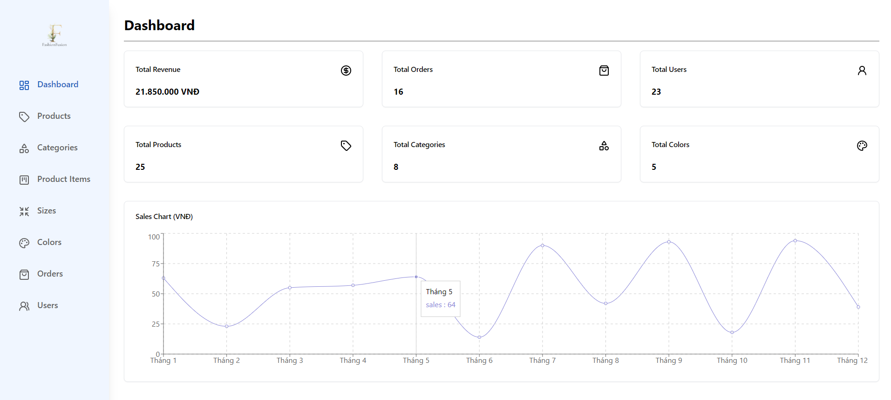
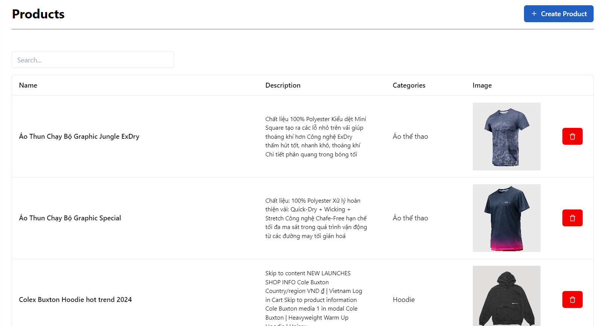
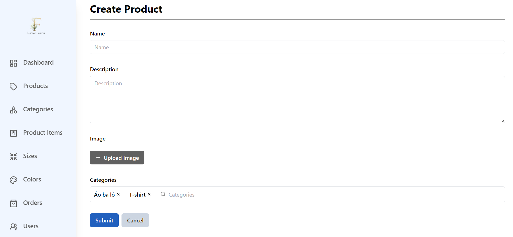
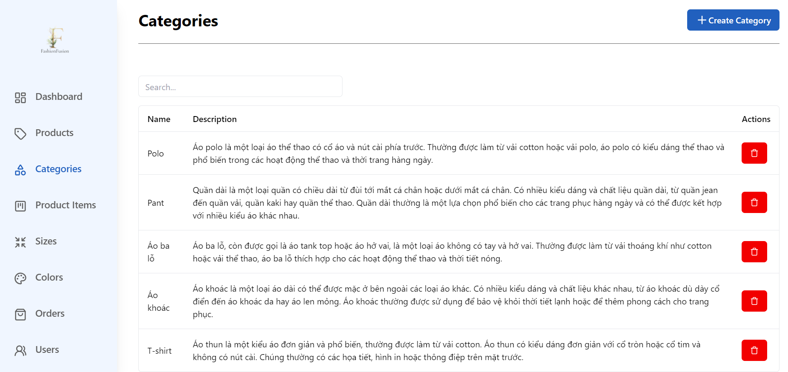
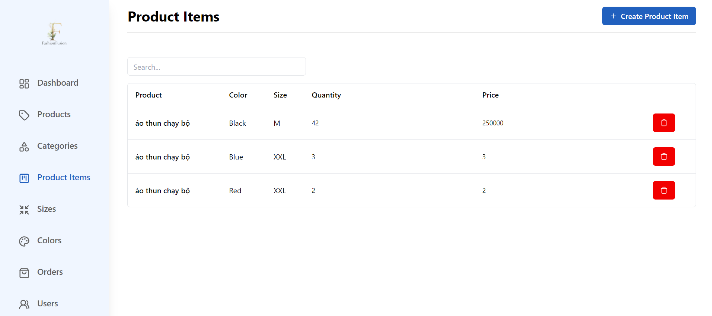
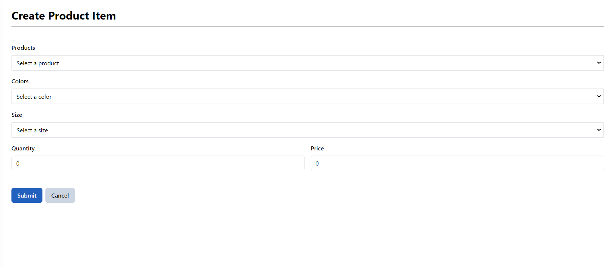
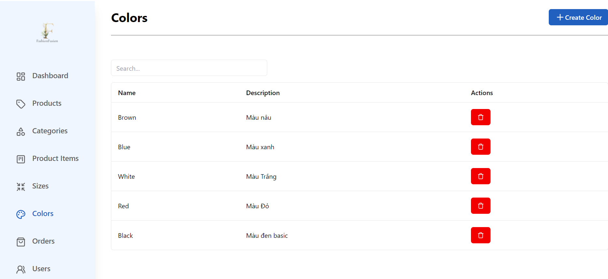
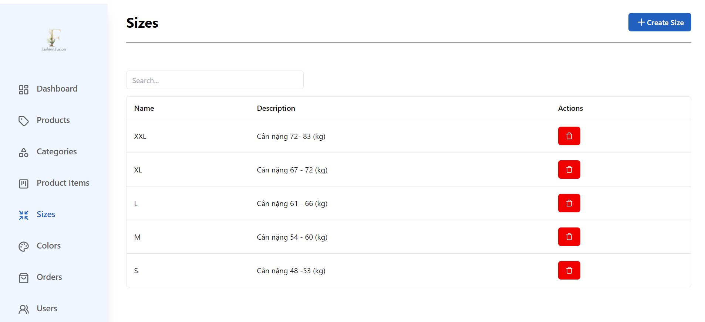
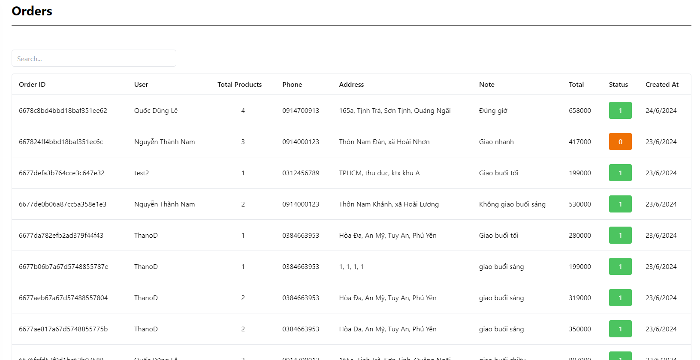
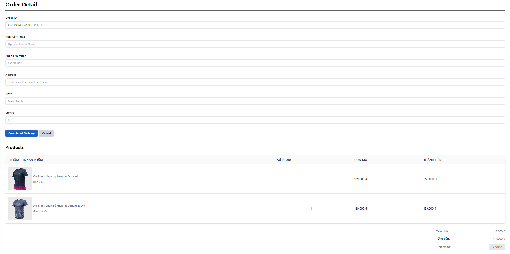

#  Fashion Fusion (Website for Admin)
A website that provides an user-friendly interface for administrators to manage client's site interactions. It is built using the Client-Server architecture.

## Features

- Modern visual dashboard.
- Products management.
- Categories management.
- Product Items management.
- Colors management.
- Sizes management.
- Users management.
- Orders management.
- Confirm status for Orders

## Requirement
- Runtime environment:
    - Node.js 20.10.0+.
    - MongoDB for database storage.
    - Firebase Storage for file storage.
    - Vercel for hosting.

- Development environment:
    - Node.js 20.10.0+.
    - Nextjs 14 for frontend development.
    - Tailwind CSS for styling.
    - MongoDB for database storage.
    - Firebase Storage for file storage.
      
## Installation Guide

To install and run the project locally, follow these steps:

1. Clone this repo.
2. Run `npm install` to install the dependencies.
3. Run `npm run dev` to start the server.

## User Interface

## Authors

[Lê Quốc Dũng](https://github.com/DungLe2983)

[Phạm Thanh Đồng ](https://github.com/ThanhDong00)
